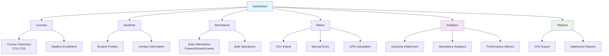
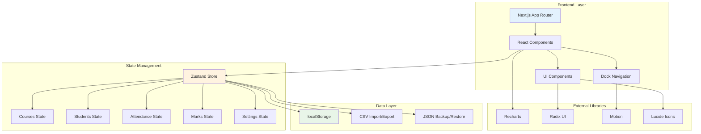
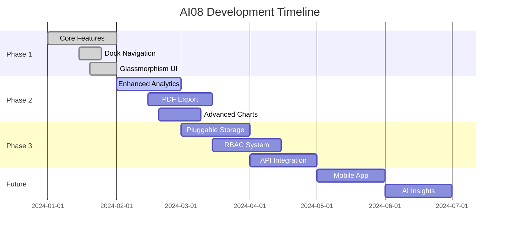

<div align="center">

# 🎯 AI08

## Autom8 Dashboard

*A modern, glassy Course Outcome Attainment dashboard*

Manage courses, students, attendance, marks, analytics, and reports with a slick dock-style UI.  
Local-first by default (no backend required).

[](https://opensource.org/licenses/MIT)
[](https://nextjs.org/)
[](https://www.typescriptlang.org/)
[](https://tailwindcss.com/)

</div>

## ✨ Features
- Dock-style navigation with smooth magnification
- Glassmorphism UI, subtle motion, and accessibility-minded components
- End-to-end flow: Courses → Students → Attendance → Marks → Analytics → Reports
- Local-first data stored in your browser (export/import supported)
- CSV import for marks and CSV export for reports

## 🚀 Quickstart
Prereqs: Node.js 18+

```bash
npm install --legacy-peer-deps
npm run dev
```

Open http://localhost:3000

## 🧭 Product Tour



### Core Modules
- **Dashboard**: Key stats and quick actions
- **Courses**: Create/manage courses and outcomes (CO1–CO6)
- **Students**: Manage roster and profiles
- **Attendance**: Per-course daily marking with bulk save and status cycling
- **Marks**: CSV import, manual entry, GPA mapping
- **Analytics**: Outcome attainment, attendance, and GPA visuals
- **Reports**: Export attainment reports (CSV)
- **Data Management**: Full backup/restore (JSON)
- **Settings**: Targets and weightages with reset defaults

## 🧩 Tech Stack
- Next.js 15, React 19, TypeScript
- Tailwind CSS, Radix UI
- Zustand (state)
- Recharts (charts)
- motion (Framer Motion v11 API)

## 🛠️ Scripts
```bash
npm run dev      # start dev server
npm run build    # build for production
npm run start    # run production build
npm run lint     # lint
```

## 🗂️ Architecture



### Project Structure
```
autom8-dashboard/
├── app/                    # Next.js App Router pages
│   ├── analytics/         # Analytics dashboard
│   ├── attendance/        # Attendance management
│   ├── courses/           # Course management
│   ├── students/          # Student management
│   ├── marks/             # Marks & grading
│   └── ...
├── components/            # Reusable UI components
│   ├── ui/               # Base UI components
│   ├── dock.tsx          # Navigation dock
│   └── layout-wrapper.tsx
├── lib/
│   ├── store.ts          # Zustand global state
│   └── utils.ts          # Utility functions
└── styles/               # Global CSS
```

## 🔐 Privacy
- All data stays in the browser via `localStorage`
- Import/Export for portability

## 🤝 Contributing
We welcome issues and PRs.
1. Fork and create a feature branch
2. Follow ESLint/Prettier, keep components typed and accessible
3. Explain the problem/solution clearly in the PR

Good first issues:
- Unit tests for `lib/store.ts`
- Reduced-motion preferences
- Additional analytics (sparklines, trends)
- CSV templates for marks/attendance

## 🛣️ Roadmap



### Upcoming Features
- **Phase 2**: Enhanced analytics with cohort comparisons and time-series data
- **Phase 2**: PDF export for official reports and certificates
- **Phase 3**: Pluggable storage adapters (Supabase/Firebase/PostgreSQL)
- **Phase 3**: Role-based access control (admin/instructor/student roles)
- **Future**: Mobile companion app and AI-powered insights

## 📜 License
MIT. See `LICENSE`.

## 🙌 Acknowledgements
- Icons: `lucide-react`
- Components: Radix UI
- Charts: Recharts
- Motion: `motion` (Framer Motion v11 API)

---

<div align="center">

**Built with ❤️ by the AI08 Team**

*Empowering educators with modern technology*

[⭐ Star this repo](https://github.com/your-username/autom8-dashboard) • [🐛 Report Bug](https://github.com/your-username/autom8-dashboard/issues) • [💡 Request Feature](https://github.com/your-username/autom8-dashboard/issues)

If you build on Autom8, let us know — we'd love to feature it!

</div>
